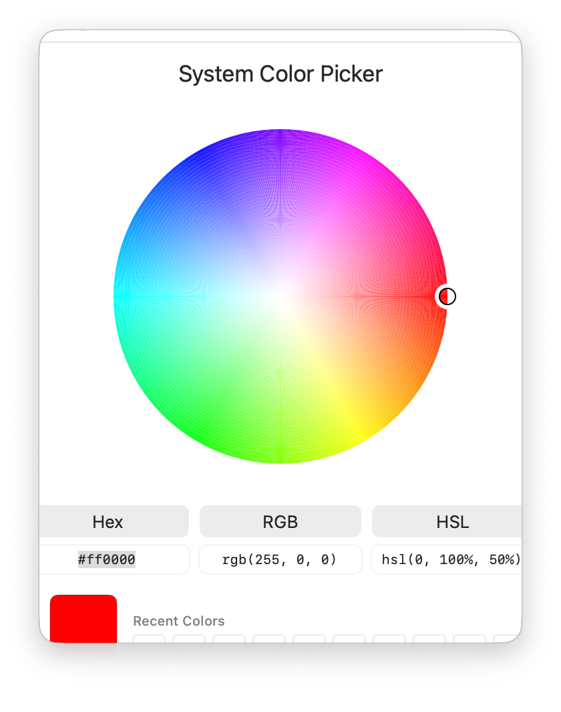

# PixelPick

A modern, compact color picker app for macOS built with SwiftUI. Features an intuitive color wheel interface, multiple color format outputs, and comprehensive customization options.



## ✨ Features

### 🎨 Color Selection
- **Interactive Color Wheel**: Smooth, responsive HSV color wheel with visual selector
- **Screen Color Picker**: Sample colors from anywhere on your screen with the eyedropper tool
- **Color History**: Automatically saves your last 10 picked colors for quick access

### 📋 Multiple Color Formats
- **HEX**: `#FF0000` or `#ff0000` (configurable case)
- **RGB**: `rgb(255, 0, 0)` or `255, 0, 0` (legacy syntax option)
- **HSL**: `hsl(0, 100%, 50%)` or `0°, 100%, 50%` (legacy syntax option)
- **One-Click Copy**: Click any format button to copy to clipboard instantly

### ⚙️ Customization Options
- **Show in menu bar**: Quick access from the menu bar
- **Launch at login**: Automatically start with macOS
- **Stay on top**: Keep window above other applications
- **Auto color sampler**: Automatically activate picker when opening
- **Dynamic theme adaptation**: Follow macOS system appearance
- **Manual dark mode**: Override system theme settings

### 🎯 Compact Design
- **Optimized Size**: 420×480 window for efficient screen usage
- **Clean Interface**: Minimalist design focused on functionality
- **Responsive Layout**: Adapts beautifully to window resizing

## 🚀 Installation

### Requirements
- macOS 12.0+ (Monterey or later)
- Xcode 14.0+ (for building from source)

### Building from Source
1. Clone the repository:
   ```bash
   git clone https://github.com/mingmanhk/PixelPick.git
   cd PixelPick
   ```

2. Open `PixelPick.xcodeproj` in Xcode

3. Build and run the project (⌘+R)

## 📱 Usage

### Basic Color Selection
1. **Color Wheel**: Click and drag on the color wheel to select colors
2. **Screen Picker**: Click "Pick Color" button and select any color from your screen
3. **Recent Colors**: Click any of the recent color swatches to reuse previous selections

### Copying Color Values
- Click **Hex**, **RGB**, or **HSL** buttons to instantly copy values to clipboard
- Values automatically update as you select different colors
- Text fields show current values in real-time

### Customization
- Press `⌘+,` or use menu **PixelPick → Preferences** to access settings
- Enable "Dynamic colors adapt to macOS theme" for automatic light/dark mode switching
- Configure color format preferences (uppercase hex, legacy syntax)

## 🏗️ Technical Details

### Built With
- **SwiftUI**: Modern declarative UI framework
- **AppKit**: Native macOS integration
- **Swift Concurrency**: Async/await for smooth color sampling
- **ServiceManagement**: Login item management
- **Combine**: Reactive preferences system

### Architecture
- **MVVM Pattern**: Clean separation of concerns
- **Environment Objects**: Centralized preferences management
- **Observable Objects**: Reactive color history and preferences
- **Canvas**: High-performance color wheel rendering

### Key Components
- `ColorWheelView`: Custom HSV color wheel with Canvas
- `ScreenColorPicker`: Async color sampling from screen
- `Preferences`: Comprehensive app settings management
- `ColorUtils`: Multi-format color conversion utilities

## 🤝 Contributing

Contributions are welcome! Please feel free to submit a Pull Request. For major changes, please open an issue first to discuss what you would like to change.

### Development Setup
1. Fork the repository
2. Create your feature branch (`git checkout -b feature/AmazingFeature`)
3. Commit your changes (`git commit -m 'Add some AmazingFeature'`)
4. Push to the branch (`git push origin feature/AmazingFeature`)
5. Open a Pull Request

## 📝 License

This project is licensed under the MIT License - see the [LICENSE](LICENSE) file for details.

## 🙏 Acknowledgments

- Built with Apple's SwiftUI framework
- Color conversion algorithms based on standard HSV/HSL specifications
- UI inspiration from modern macOS design principles

## 📞 Support

If you encounter any issues or have feature requests, please [open an issue](https://github.com/mingmanhk/PixelPick/issues) on GitHub.

---

**Made with ❤️ for macOS developers and designers**
