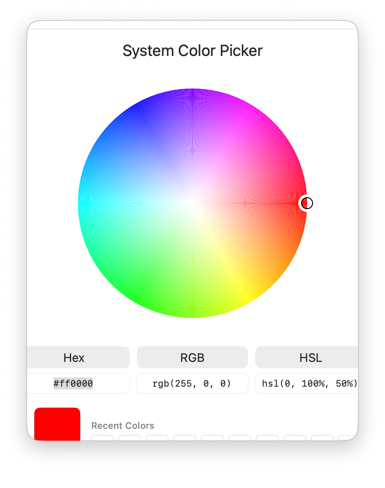

# PixelColorPick for macOS

[](https://swift.org)
[](https://www.apple.com/macos)
[](https://www.apple.com/macos/monterey)
[](LICENSE)

A modern, lightweight, and open-source color picker for macOS, built with the power of SwiftUI. PixelColorPick is designed for developers, designers, and anyone who works with color.

<p align="center">
  
</p>

---

## ✨ Features

PixelColorPick is packed with features to make your color workflow faster and more enjoyable:

-   🎨 **Interactive Color Wheel:** A beautiful and responsive HSV color wheel lets you explore the color spectrum with ease.
-   💧 **Screen-Wide Eyedropper:** Pick any color from anywhere on your screen with a powerful magnifying loupe for pixel-perfect precision.
-   📋 **Instant Copy:** Copy color codes in popular formats (HEX, RGB, HSL) directly to your clipboard with a single click.
-   🕰️ **Color History:** Your 10 most recent colors are automatically saved, so you can always find your way back.
-   🔧 **Deeply Customizable:**
    -   Run PixelColorPick from the menu bar for quick access.
    -   Set it to launch at login.
    -   Keep the picker window always on top.
-   🍎 **Native macOS Experience:** Seamlessly integrates with your system, including full support for Light and Dark Modes.

## 🚀 Getting Started

### Prerequisites

-   macOS 12.0 (Monterey) or later.
-   Xcode 13.0 or later.

### Installation

You can build PixelColorPick from the source code.

1.  **Clone the repository:**
    ```bash
    git clone https://github.com/mingmanhk/PixelColorPick.git
