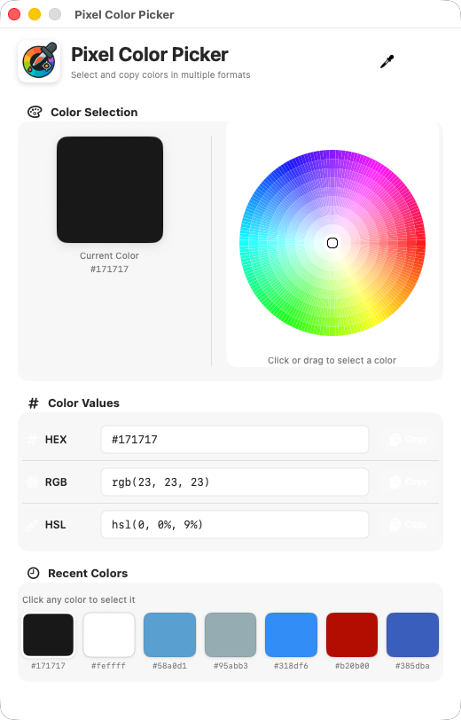
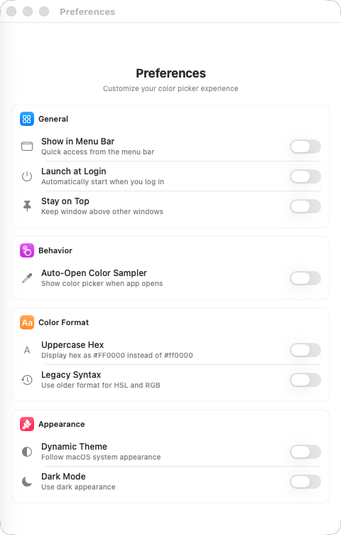

# PixelColorPick for macOS

[](https://swift.org)
[](https://www.apple.com/macos)
[](https://www.apple.com/macos/monterey)
[](LICENSE)

A modern, lightweight, and open-source color picker for macOS, built with the power of SwiftUI. PixelColorPick is designed for developers, designers, and anyone who works with color.

## 🎯 Promotional Text

**"The color picker you've been waiting for."**

Transform your creative workflow with Pixel Color Picker – the fastest, most elegant way to capture, explore, and copy colors on macOS. Whether you're designing a website, creating digital art, or perfecting your brand palette, get instant access to any color on your screen with pixel-perfect precision.

✨ **Beautiful & Intuitive** – Modern SwiftUI interface that feels right at home on macOS  
⚡ **Lightning Fast** – Pick colors in milliseconds with keyboard shortcuts  
🎨 **Professional Tools** – Interactive color wheel, format conversion, and smart history  
🔒 **Privacy First** – Works completely offline, no data collection, 100% open source  

Perfect for designers, developers, artists, and anyone who takes color seriously.

## 🆕 What's New in This Version

**Version 2.0 - Major Update**

🎨 **Enhanced UI/UX**
- Redesigned main interface with app icon in header for better brand recognition
- Optimized window sizes for perfect fit without scrolling (520×780)
- Improved preferences window layout (480×720)

⚡ **Performance & Polish**
- Faster color picking with improved eyedropper tool
- Smoother color wheel interactions
- Enhanced haptic feedback for better user experience

🎯 **New Features**
- Auto-open color sampler on launch (optional)
- Dynamic theme adaptation following system appearance
- Improved color history with visual selection indicators
- Better keyboard shortcut support (⌘P for quick pick)

🔧 **Improvements**
- More reliable launch at login functionality
- Better stay-on-top window management
- Refined color format options (uppercase hex, legacy syntax)
- Enhanced copy feedback with visual confirmation

🐛 **Bug Fixes**
- Fixed color wheel precision issues
- Improved color space conversions
- Better handling of edge cases in format conversion

## 📸 Screenshots

<p align="center">
  
  <br/>
  <em>Main Interface - Interactive color wheel and instant format conversion</em>
</p>

<p align="center">
  
  <br/>
  <em>Preferences - Customize your color picking experience</em>
</p>

<p align="center">
  
  <br/>
  <em>Available on the Mac App Store</em>
</p>

---

## ✨ Features

PixelColorPick is packed with features to make your color workflow faster and more enjoyable:

-   🎨 **Interactive Color Wheel:** A beautiful and responsive HSV color wheel lets you explore the color spectrum with ease.
-   💧 **Screen-Wide Eyedropper:** Pick any color from anywhere on your screen with a powerful magnifying loupe for pixel-perfect precision.
-   📋 **Instant Copy:** Copy color codes in popular formats (HEX, RGB, HSL) directly to your clipboard with a single click.
-   🕰️ **Color History:** Your 10 most recent colors are automatically saved, so you can always find your way back.
-   🔧 **Deeply Customizable:**
    -   Run PixelColorPick from the menu bar for quick access.
    -   Set it to launch at login.
    -   Keep the picker window always on top.
-   🍎 **Native macOS Experience:** Seamlessly integrates with your system, including full support for Light and Dark Modes.

## 🚀 Getting Started

### Prerequisites

-   macOS 12.0 (Monterey) or later.
-   Xcode 13.0 or later.

### Installation

You can build PixelColorPick from the source code.

1.  **Clone the repository:**
    ```bash
    git clone https://github.com/mingmanhk/PixelColorPick.git
